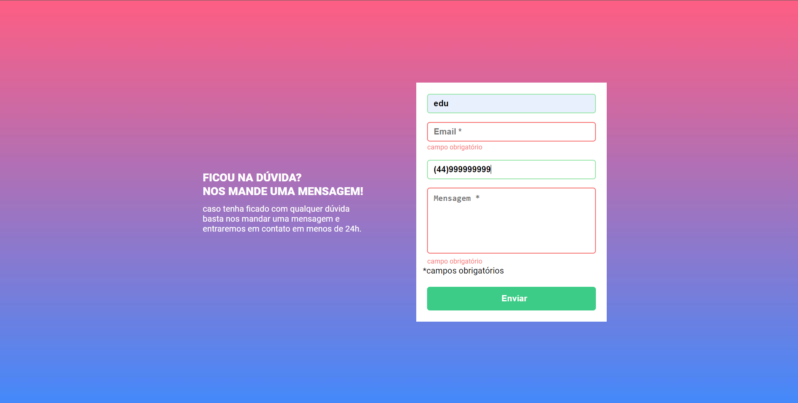
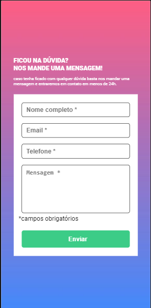

# Formulario com validação

## Testado com Responsive Viewer :

 

### Visualização em desktop

### Visualização em mobile

(Pressione CTRL + clique na imagem para abrir o projeto em uma nova guia)

## Linguagens utilizadas

- HTML
- CSS 
- JavaScript

## Comentarios

Projeto proposto pelo curso DevQuest, afim de praticar alguns conhecimentos adquiridos em JS.